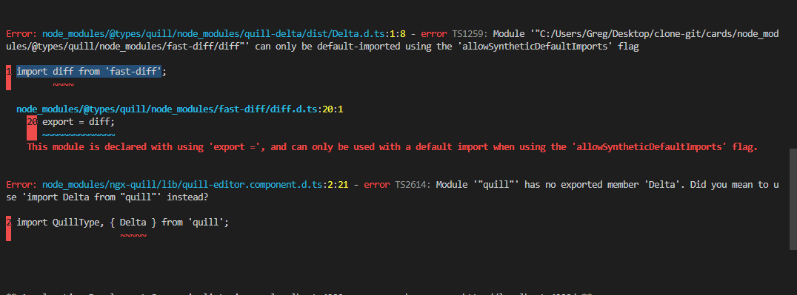

# Тестовый проект для контроля работы юристов
Демо этого проекта можно посмотреть [здесь](https://gregtstu.github.io/test-hosting/)

# Скачать архив
Если нет желания клонировать проект через гит, чтобы не производить настройку **ngx-quill**, можно скачать данный проект с яндекс диска по [ссылке](https://disk.yandex.ru/d/YT4JJ09E48Ijvw)

# Запуск проекта
Перед запуском проекта необходимо поставить дополнительные пакеты (node modules) командой `npm install --save-dev @angular-devkit/build-angular` после этого можно запускать проект командой `npm start`

# Настройка проекта
В проекте используется текстовый редактор **ngx-quill**. Для того чтобы проект работал корректно необходимо настроить **ngx-quill**.

### Устранение багов
После запуска проекта в консоле появятся баги, который очень просто устраняются

***
Данный импорт\
2 import QuillType, { Delta } from 'quill';\
меняем на\
2 import QuillType from 'quill';\
3 import Delta from "quill";
***
Данный импорт\
1 import diff from 'fast-diff';\
меняем на\
1 // @ts-ignore\
2 import diff from 'fast-diff';
***
**После настройки ngx-quill можно запускать проект**.
